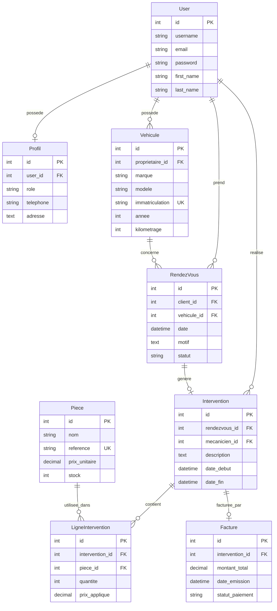

# Conception — MaintenanceAuto

## 1. Schéma de la base de données



---

## 2. Liste des endpoints API

Base URL : `http://127.0.0.1:8000/api/`

### Authentification

| Méthode | Endpoint | Auth | Description |
|---------|----------|------|-------------|
| POST | `/auth/login/` | Non | Connexion — retourne access + refresh JWT |
| POST | `/auth/refresh/` | Non | Rafraîchir le token d'accès |
| POST | `/auth/register/` | Non | Inscription client uniquement |
| POST | `/auth/creer-staff/` | Admin | Créer un mécanicien ou administrateur |

### Profils

| Méthode | Endpoint | Auth | Description |
|---------|----------|------|-------------|
| GET | `/profils/` | Oui | Liste des profils (admin : tous, autres : le sien) |
| GET | `/profils/{id}/` | Oui | Détail d'un profil |
| GET | `/profils/me/` | Oui | Profil de l'utilisateur connecté |

### Véhicules

| Méthode | Endpoint | Auth | Description |
|---------|----------|------|-------------|
| GET | `/vehicules/` | Oui | Liste (client : siens, admin : tous) |
| POST | `/vehicules/` | Oui | Ajouter un véhicule (client) |
| GET | `/vehicules/{id}/` | Oui | Détail d'un véhicule |
| PUT/PATCH | `/vehicules/{id}/` | Oui | Modifier un véhicule |
| DELETE | `/vehicules/{id}/` | Oui | Supprimer un véhicule |

### Rendez-vous

| Méthode | Endpoint | Auth | Description |
|---------|----------|------|-------------|
| GET | `/rendezvous/` | Oui | Liste des RDV (filtrée par rôle) |
| POST | `/rendezvous/` | Oui | Prendre un RDV (client) |
| GET | `/rendezvous/{id}/` | Oui | Détail d'un RDV |
| PATCH | `/rendezvous/{id}/` | Oui | Modifier statut (mécanicien/admin) |

### Interventions

| Méthode | Endpoint | Auth | Description |
|---------|----------|------|-------------|
| GET | `/interventions/` | Oui | Liste (mécanicien : siennes) |
| POST | `/interventions/` | Oui | Créer une intervention |
| GET | `/interventions/{id}/` | Oui | Détail avec lignes de pièces |
| PATCH | `/interventions/{id}/` | Oui | Modifier une intervention |
| POST | `/interventions/{id}/ajouter-piece/` | Méca/Admin | Ajouter une pièce + décrémenter stock |
| POST | `/interventions/{id}/generer-facture/` | Admin | Générer une facture manuellement |

### Pièces (stock)

| Méthode | Endpoint | Auth | Description |
|---------|----------|------|-------------|
| GET | `/pieces/` | Méca/Admin | Consulter le stock |
| POST | `/pieces/` | Admin | Ajouter une pièce |
| GET | `/pieces/{id}/` | Méca/Admin | Détail d'une pièce |
| PUT/PATCH | `/pieces/{id}/` | Admin | Modifier une pièce |
| DELETE | `/pieces/{id}/` | Admin | Supprimer une pièce |

### Factures

| Méthode | Endpoint | Auth | Description |
|---------|----------|------|-------------|
| GET | `/factures/` | Oui | Liste (client : siennes, admin : toutes) |
| POST | `/factures/` | Admin | Créer une facture |
| GET | `/factures/{id}/` | Oui | Détail d'une facture |
| PATCH | `/factures/{id}/` | Admin | Modifier statut paiement |
| POST | `/factures/{id}/recalculer/` | Admin | Recalculer le montant |

### Utilisateurs (admin)

| Méthode | Endpoint | Auth | Description |
|---------|----------|------|-------------|
| GET | `/users/` | Admin | Liste des utilisateurs Django |
| GET | `/users/{id}/` | Admin | Détail utilisateur |

---

## 3. Pages frontend

| URL | Rôle | Description |
|-----|------|-------------|
| `/` | Tous | Page de connexion |
| `/inscription/` | Public | Inscription client + redirection auto |
| `/dashboard/client/` | Client | Véhicules, RDV, factures |
| `/dashboard/mecanicien/` | Mécanicien | RDV, interventions, pièces |
| `/dashboard/admin/` | Admin | Dashboard, users, stock, factures |
| `/api/docs/` | Tous | Documentation Swagger interactive |

---

## 4. Architecture logicielle

```
templates/          → Frontend HTML/JS (consomme l'API via fetch + JWT)
garage/
  views.py          → ViewSets DRF + endpoints custom
  serializers.py    → Sérialisation JSON
  permissions.py    → Permissions par rôle
  services/         → Logique métier
  models.py         → Modèles ORM Django
config/
  settings.py       → Configuration (variables .env)
  urls.py           → Routage global
```
